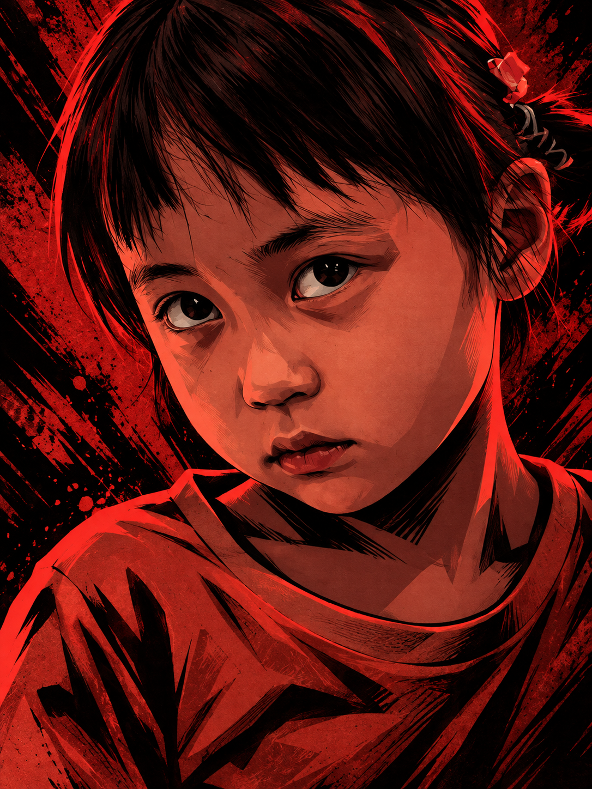

# jwan-dark-red-black-cel-shaded

Jwan dark red and black cel-shaded portrait diptych Skill.

## Features

- Preserve the supplied photo in the upper half of a vertical 9:16 image.
- Create a centered dark red and black cel-shaded portrait below.
- Keep identity, pose, clothing cues, and the main gesture recognizable.

## Case

## Usage

Use `$jwan-dark-red-black-cel-shaded` followed by one portrait photo. Add optional instructions for mood or signature.

## Repository structure

- `SKILL.md` — complete Skill definition
- `examples/` — generated case images
- `README.md` — usage and project notes
- `LICENSE` — MIT license for this Jwan adaptation

## Attribution

This is a Jwan-specific adaptation inspired by [Wibi Style dark-red-black-cel-shaded](https://github.com/Vieeeeeee/wibi-style/tree/main/skills/dark-red-black-cel-shaded). Review the source repository for its original attribution and license terms.

## License

Jwan-authored material in this repository is released under the MIT License. See `LICENSE`.
